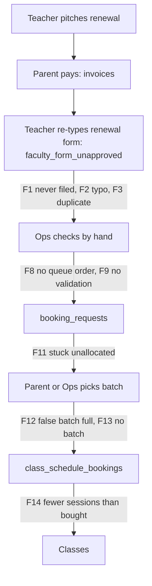
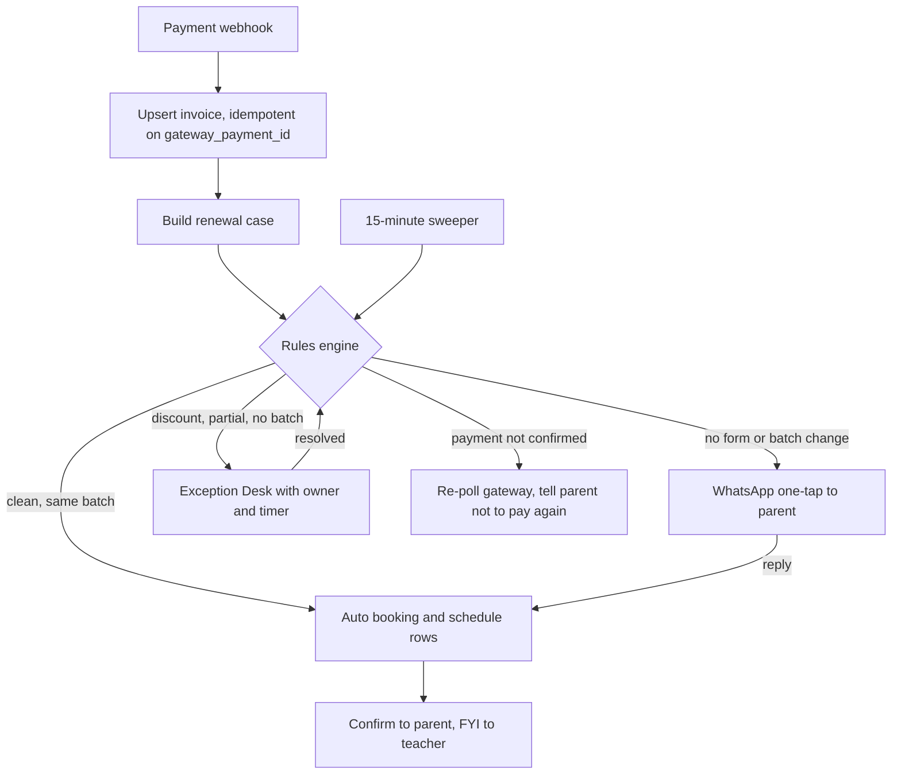

# Diagrams

## As-is

```mermaid
flowchart TD
  A[Teacher pitches renewal] --> B[Parent pays: invoices]
  B --> C[Teacher re-types renewal form: faculty_form_unapproved]
  C -->|F1 never filed, F2 typo, F3 duplicate| D[Ops checks by hand]
  D -->|F8 no queue order, F9 no validation| E[booking_requests]
  E -->|F11 stuck unallocated| F[Parent or Ops picks batch]
  F -->|F12 false batch full, F13 no batch| G[class_schedule_bookings]
  G -->|F14 fewer sessions than bought| H[Classes]
```

## To-be

```mermaid
flowchart TD
  W[Payment webhook] --> U[Upsert invoice, idempotent on gateway_payment_id]
  U --> R[Build renewal case]
  R --> E{Rules engine}
  E -->|clean, same batch| G[Auto booking and schedule rows]
  E -->|no form or batch change| P[WhatsApp one-tap to parent]
  E -->|discount, partial, no batch| X[Exception Desk with owner and timer]
  E -->|payment not confirmed| B[Re-poll gateway, tell parent not to pay again]
  G --> C[Confirm to parent, FYI to teacher]
  P -->|reply| G
  X -->|resolved| E
  S[15-minute sweeper] --> E
```
